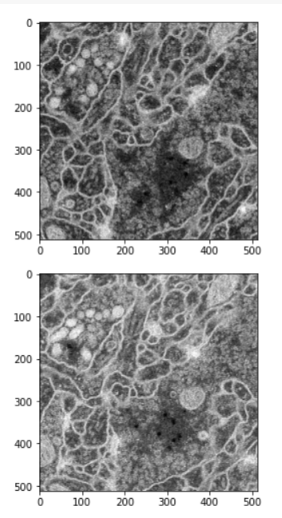

# Biomedical-Image-Segmentation
Segmentation of Biomedical images in the ISBI 2015 challenge dataset using UNET architecture.

The architecture was inspired by [U-Net: Convolutional Networks for Biomedical Image Segmentation](http://lmb.informatik.uni-freiburg.de/people/ronneber/u-net/).

---

## Overview

### Data

The original dataset is from [isbi challenge](http://brainiac2.mit.edu/isbi_challenge/), and I've downloaded it and done the pre-processing.

You can find it in folder data/membrane.

### Data augmentation

The data for training contains 30 512*512 images, which are far not enough to feed a deep learning neural network. I use a module called ImageDataGenerator in keras.preprocessing.image to do data augmentation.

See dataPrepare.ipynb and data.py for detail.

### Model

This deep neural network is implemented with Keras functional API, which makes it extremely easy to experiment with different interesting architectures.

Output from the network is a 512*512 which represents mask that should be learned. Sigmoid activation function
makes sure that mask pixels are in \[0, 1\] range.

### Training

The model is trained for 7 epochs with a batch size of 4.

After 7 epochs, calculated accuracy is about 0.92.

Loss function for the training is basically just a binary crossentropy.

---

## How to use

### Dependencies

This tutorial depends on the following libraries:

* Tensorflow
* Keras >= 1.0

Also, this code should be compatible with Python versions 2.7-3.5.

### Results

The test accuracy is around 92%. The predictions made by the model are visible in the notebook.
     

## About Keras

Keras is a minimalist, highly modular neural networks library, written in Python and capable of running on top of either TensorFlow or Theano. It was developed with a focus on enabling fast experimentation. Being able to go from idea to result with the least possible delay is key to doing good research.

Use Keras if you need a deep learning library that:

allows for easy and fast prototyping (through total modularity, minimalism, and extensibility).
supports both convolutional networks and recurrent networks, as well as combinations of the two.
supports arbitrary connectivity schemes (including multi-input and multi-output training).
runs seamlessly on CPU and GPU.
Read the documentation [Keras.io](http://keras.io/)

Keras is compatible with: Python 2.7-3.5.
